# 개요
금융상품 통합 비교공시 데이터 open API를 활용한 금융 상품 추천 서비스

# 기간
2023.11.13 ~ 2023.11.24

# 팀원 정보 및 업무 분담 내역
- 김영준(팀장): DB 모델링, 백엔드 메인(커뮤니티 DRF, 나이별 추천 알고리즘 API 개발), 프론트엔드 보조, 발표
- 윤예빈(팀원): DB 모델링, UI/UX 디자인, 백엔드 보조(설문조사 별 추천 알고리즘 API 개발), 프론트엔드 메인(컴포넌트 구조, CSS), 더미데이터 생성

# 서비스 대표 기능들에 대한 설명
- 환율계산기 : 환율 API에서 받아온 데이터들을 입력한 한국돈에 따라 얼마인지 보여준다
- 카카오맵 : 위치와 은행명을 적으면 해당 위치 주변의 은행을 보여준다
- 예적금 추천 상품 : 기본 탭 알고리즘에 맞는 상품을 추천해준다
- 설문조사 : 금융상품과 관련된 설문조사를 진행
- 설문조사 기반 추천 : 설문조사 기반으로 추천한다
- 나이별 추천 : 유저의 나이보다 -10살 ~ + 10살 범위의 이용자들이 많이 가입한 상품을 추천해준다
- 이벤트 캐로셀 : 지금 진행중인 금융 상품들 페이지에 연결해준다

## 금융 상품 추천 알고리즘에 대한 기술적 설명
1. 기본 탭에서 추천하는 기능
  - 예금과 적금은 고금리 순으로 추천해준다
  - 대출 상품들은 최저금리가 낮은 순으로 추천해준다 
  - 연금저축 상품은 전년도 수익율이 높은 순으로 추천해준다
2. 나의 탭에서 추천하는 기능
  1. 나이별 추천 기능
    - 유저의 나이를 받아와서 유저의 나이보다 -10살 ~ + 10살 범위의 이용자들이 많이 가입한 상품을 추천해준다
  2. 설문조사 별 추천 기능
    - 유저가 설문조사에 응한다면 설문조사 대답별로 추천해준다
        - 예적금 추천을 원한다면 고금리 상품을 추천해준다
        - 대출을 원한다면 최저금리가 낮은 순으로 추천해준다
        - 수익에 있어서 공격적인 성향이면 전년도 수익이 가장 높은 연금저축을 추천
        - 수익에 있어서 안정적인 성향이면 수익이 일정한 연금저축을 추천한다
        - 장기와 단기의 옵션을 골라 기간을 맞춰 추천한다
    
# 기타(느낀 점, 후기 등)
- 백과 프론트를 동시에 제대로 진행한 프로젝트는 처음이였는데 각각의 기능보다 굉장히 복잡하고 어려웠다.
- 뷰에서의 장단점, 장고에서의 장단점과 헷갈리는 부분에 대해서 확실하게 알고 갈 수 있었다.
- 실제로 API를 통해 다양한 정보를 받아오는 것이 상당히 어렵고 ERD의 중요성을 조금 알았다.
- 금융프로젝트라고 해서 금융 API에 한정되는게 아니라 다양한 데이터와 접목시켜서 프로젝트를 진행할 수 있다는 걸 알았다.

### 최종 화면
1. 로그인 뷰
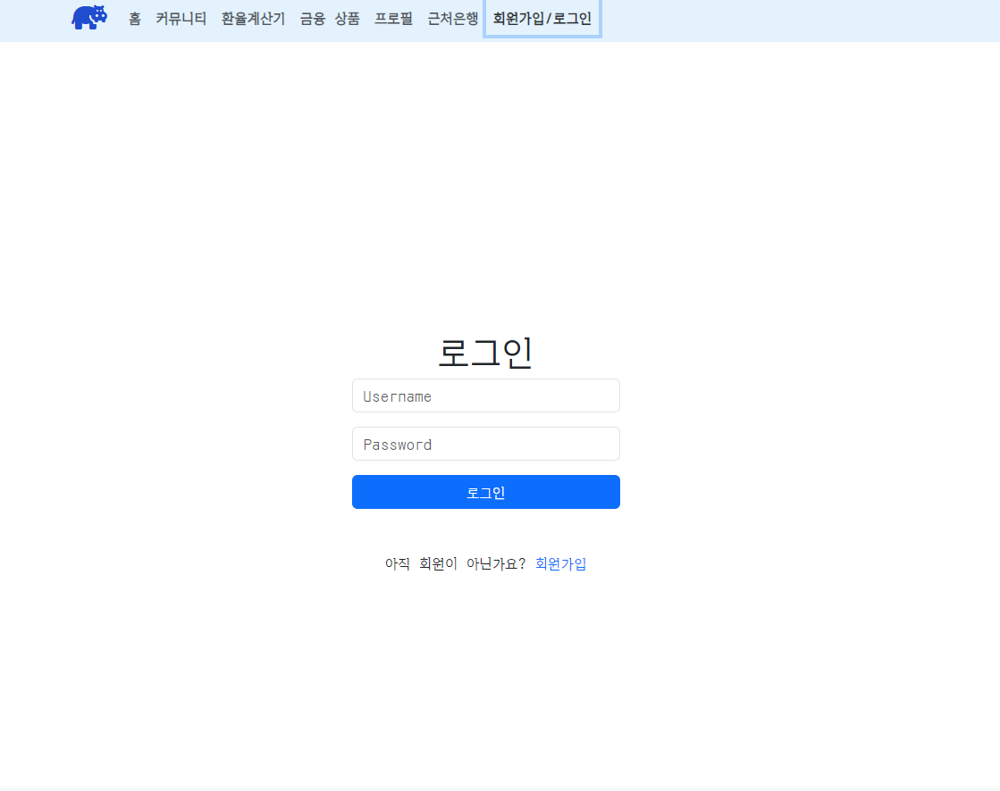
2. 홈 뷰 
 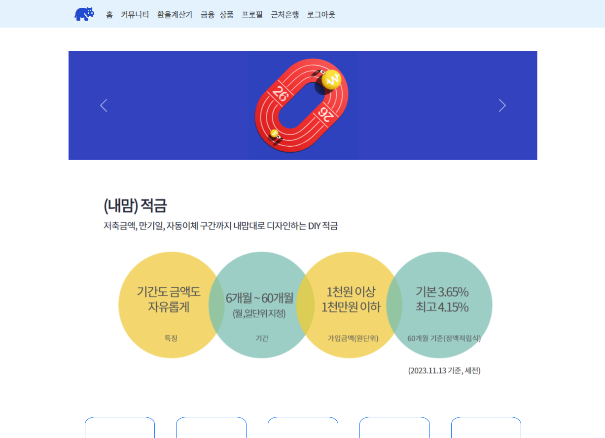
3. 커뮤니티 뷰
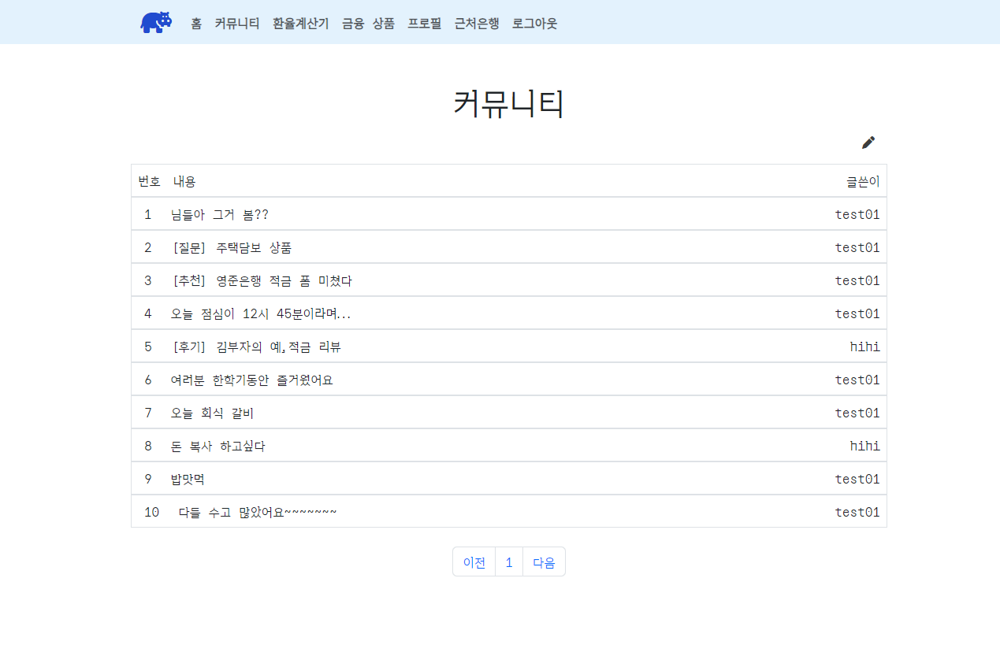

4. 환율 계산기 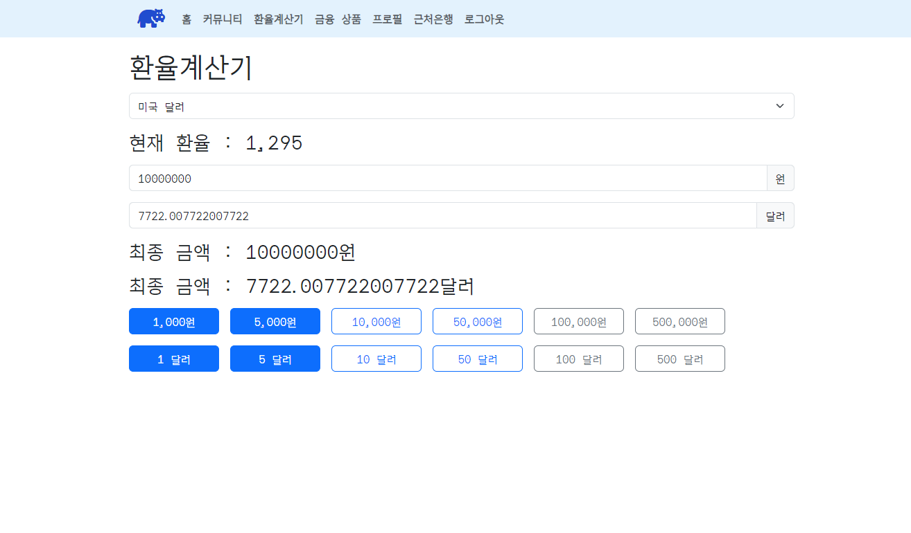

5. 금융상품 추천 탭 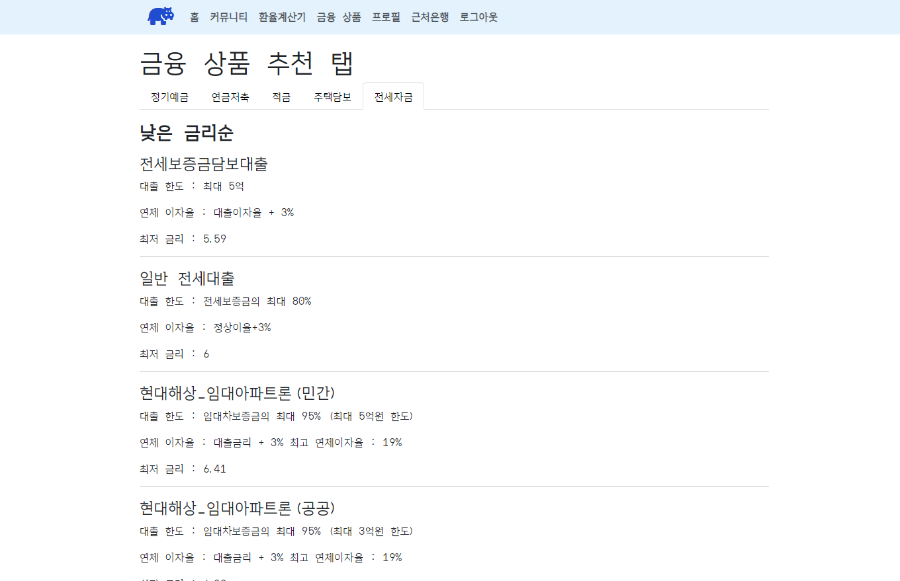
6. 금융상품 상세 페이지 뷰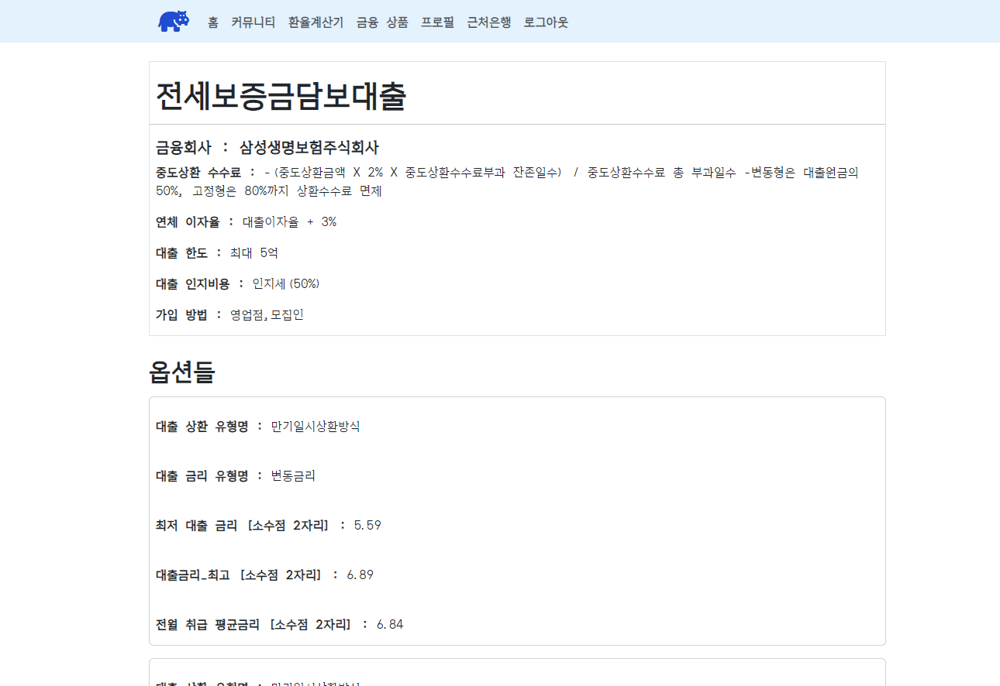
7. 프로필 뷰 - 나이별 추천 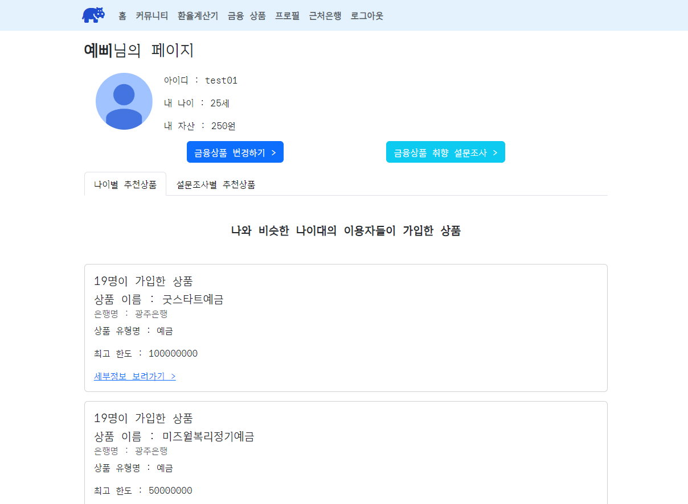
8. 프로필 뷰 - 설문조사 별 추천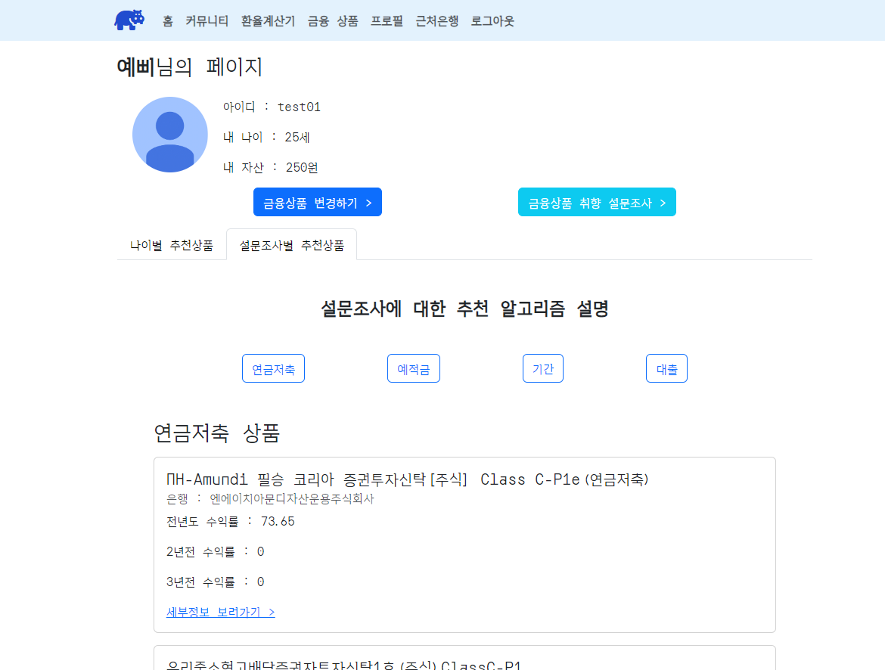
9. 프로필 뷰 - 설문조사 타입변 알고리즘 설명 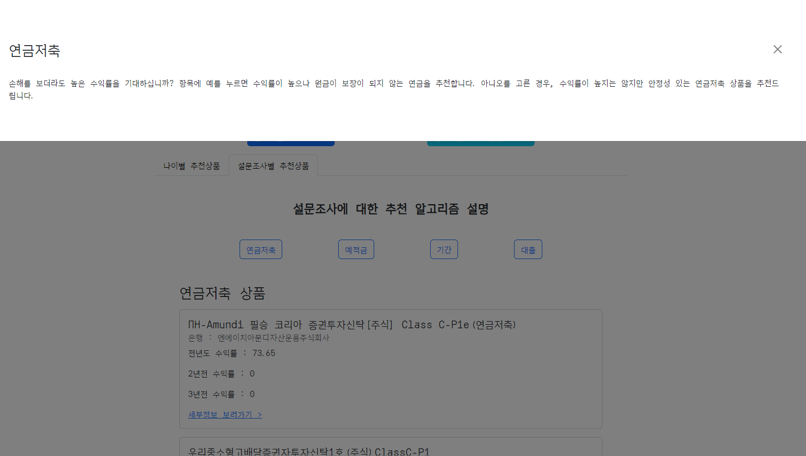
10. 설문조사 뷰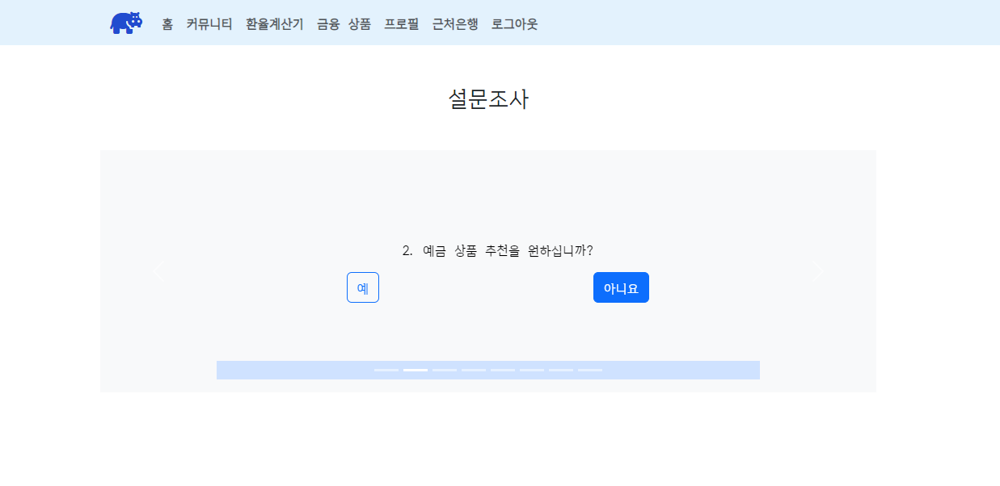
11. 은행 맵 뷰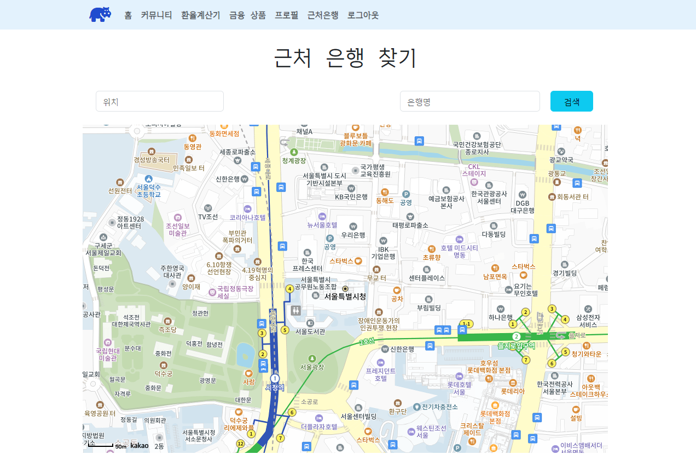
12. 은행 검색 시 화면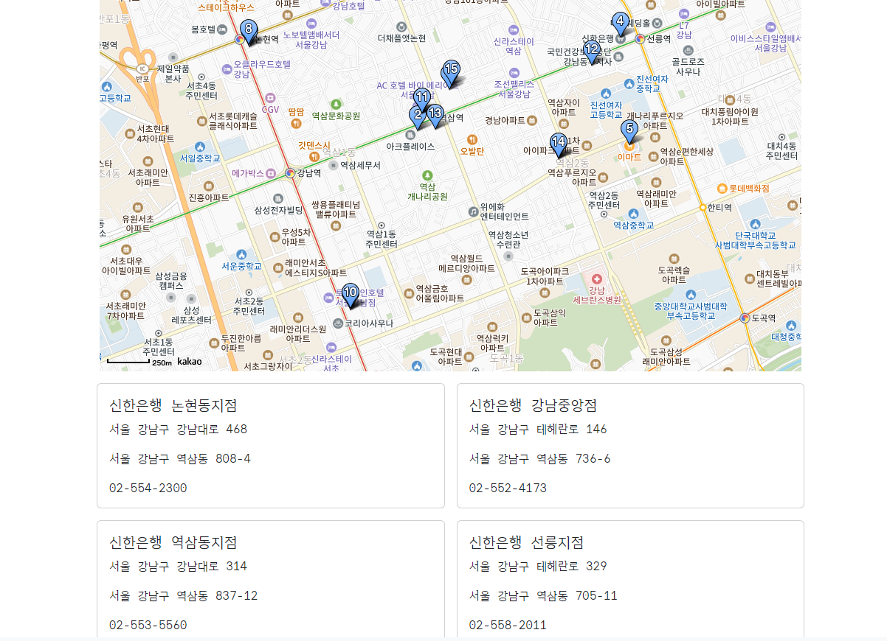

# 데이터베이스 모델링(ERD)
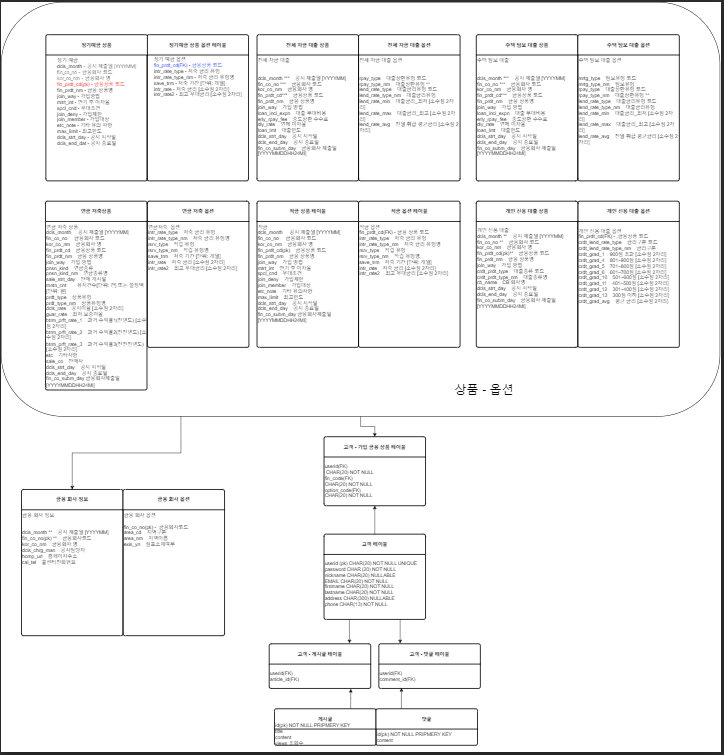
- 유저 데이터
 - 유저 이름
 - 유저 닉네임
 - 유저 적금 상품 목록
 - 자금
 - 나이
 - 연봉

- 설문조사 데이터(유저 id를 fk로 받음)
  - 유저 id(fk)
  - 위험성 유무
  - 예금 추천 유무
  - 적금 추천 유무
  - 대출 필요 유무
  - 대출 종류

- 가입한 상품 데이터(유저 id를 fk, 상품 데이터 fk로 가짐)
  - 상품 코드(fk)
  - 상품 종류
  - 유저 id (fk)
  - 유저 나이

- 게시글 데이터
  - 제목
  - 내용
  - 유저 id(fk)

- 금융상품 데이터
  - 상품
  - 옵션(상품코드를 FK로 받음)

# 일자별 진행상황 및 트러블 슈팅

## 11/16
### 진행 상황
1. 컴포넌트 관계도 작성
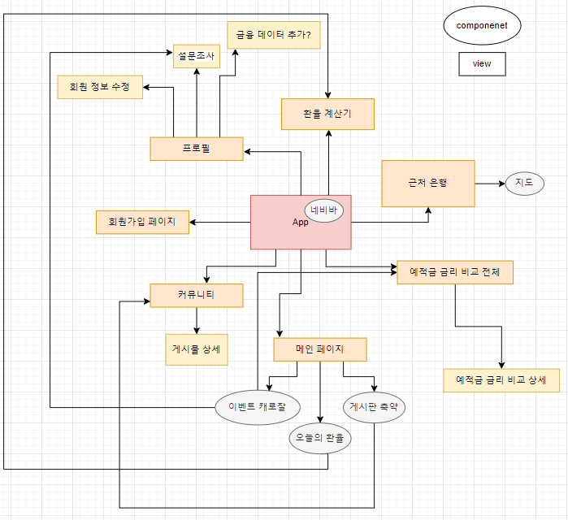
2. ERD 작성

3. django 유저 모델 만들기
4. vue 초기 화면 만들기
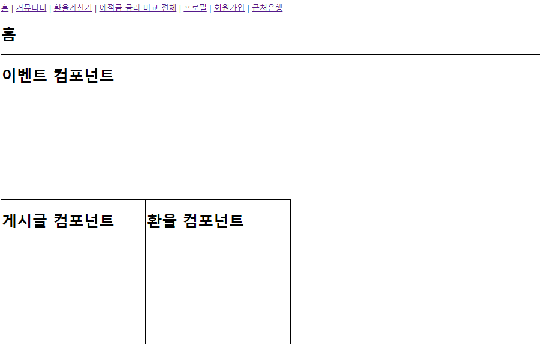
5. 기초 회원가입 툴 만들고 회원가입 완료

### 어려웠던 점
1. API를 통해 가져올 데이터들을 저장하기 위한 테이블 선언을 위해 models를 만들때, 모델 선언시 필드 값을 정하는 것에 어려움을 겪었다.
2. 각 components와 views의 관계도를 작성할 때 어떻게 작성해야 깔끔하게 정리 될까 고민하는게 어려웠다.
3. django에서 REST API를 통해 기본적으로 제공 되는 템플릿을 이용하려고 했으나, 500 error 가 발생했다.

### 오늘 알게된 점
1. installapps를 작성할때, 앱의 순서도 오류에 영향을 준다는 것을 알게되었다. 교안만을 보며 진행하지 말고, 각 라이브러리의 documentation을 보며 차근차근 설치해야 한다.
오늘은 installapps의 순서와 dj-allauth의 middleware 관련 구절을 제외하여 오류가 해결되었다. (버전 문제인 것으로 생각됨)
- 참고
  - [dj-rest-auth](https://github.com/iMerica/dj-rest-auth)
  - [dj-allauth](https://docs.allauth.org/en/latest/installation/quickstart.html)

2. 한 프로젝트에서 models를 만들 때 기존에 배운것과 같이 모델을 한 두개만 만들지 않으면 너무 많아서 프로젝트 진행에 문제점이 될 줄 알았다.
금융 상품의 json 구조가 너무 달라 하나의 모델로 통합 할 수 없을 것 같아 적은 모델로 해결하지 못해 고민하였다. 하지만 모두 다른 모델로 구성하여 관리하는 것이 효율적이라는 것을 알게되었다.

### 역할
- 김영준 : accounts 앱 빌딩, django 기본 세팅, 회원가입 django 기능 구현
- 윤예빈 : 컴포넌트 관계도 작성, ERD 구성도 작성, 회원가입 Vue 기능 구현

## 11/17
### 진행사항
- 로그인 기능, 게시글 조회, 게시글 작성, 게시글 수정, 게시글 삭제, 정기예금 상품, 옵션 모델링

### 오늘 알게된 점
1. params로 들어온 id 값은 string타입이라서 엄격한 비교(===)를 사용하면 값이 같지 않다고 인식된다. 따라서 형변환을 실행해주거나 유형변환 비교를 실행해야한다.
2. filter의 반환값은 배열이다.
3. javascript에서 type 유형 확인하는 법 = typeof
4. django-rest-auth의 account/user/ 로 들어가면 현재 로그인한 유저의 정보가 나타난다
5. vue에서 이용자의 데이터에 접근하는 방법에 대해 알게되었다.
6. serializer 커스텀하는 법
7. routerguard 사용하는 법

### 트러블 슈팅
1. 게시글 수정, 삭제를 하기 위해 해당 게시글을 작성한 유저의 정보를 가져올 필요가 있었는데 해당 정보를 가져오는것에 어려움을 겪었다. 해당 게시글의 번호를 통해서 axios 요청으로 데이터를 통째로 가져와 거기에서 해당 게시글의 작성 유저를 찾았다.
2. field 값에 user를 추가하자, 게시글 작성 시 에러가 생겼다.
   - 해결 방법 1(실패) : 현재 로그인중인 유저의 id(pk) 값을 store에 저장해 axios 요청을 보낼 때 해당 id 값을 data안에 넣어서 해당 값을 지정해주었다.
   - 해결 방법 2(성공) : article serializer에서 userserializer를 호출하여 username과 user 값을 fields로 하여 user 변수를 생성했고 articleSerializer의 fields에 user 변수를 추가했다.
3. vue에서 이용자 데이터에 접근하기 위해서는 token에 key값을 넣어줬던 것처럼, 로그인시 user 데이터를 저장해놓는 방법을 사용하였다.
4. router guard를 사용하는데 현재 접속유저가 글을 작성한 유저가 아니라면 해당 router에 대한 접속을 거부하는 로직을 짜려고 했다. 해당 로직을 구현하기 위해서는 게시글을 작성한 user의 정보가 필요했고, 현재 router에서 얻을 수 있는 정보는 params로 주어지는 article_id(게시글 번호) 뿐이었다.
   - 해당 게시글을 axios를 통해 조회하여 해당 게시글의 작성자 정보를 받아와 if문을 이용하여 해당 로직을 구현했다. 현재 로그인 중인 user의 정보는 로그인 할때 token 값을 저장하는 것 처럼 user.id 값도 같이 저장해 주었다.

### 역할
- 김영준 : 로그인 django 기능 구현, 커뮤니티 기능 구현, 커뮤니티 권한 접근 기능
- 윤예빈 :  로그인 Vue 기능 구현, 커뮤니티 컴포넌트 구현, 모델링

## 11/20
### 진행사항
- API를 통해 데이터 받아오기
- 회원가입시 유저 모델 커스텀
- 정기예금 상품 최고금리 순서대로 정렬해서 가져오기
- 정렬한 10개에 맞는 정기예금 상품을 찾아 매칭

### 트러블슈팅
- 라이브러리중 하나를 빠뜨려서 오류남
- user model을 custom해서 fields를 늘리려는게 어려웠다. 
- 회원가입 데이터를 입력했는데, db에 올라가지 않았다.
- API 내용이 명세와 달라서 일일히 다 확인해야 했다.
- serializer의 readonly 필드 지정 방법이 알고있던 것과 달라서 pk값이 제대로 저장이 안되었다. 

### 역할
- 김영준 : serializer 작성, 유저모델 커스텀
- 윤예빈 : API 데이터 받기, 정기예금 정렬하여 가져오기

## 11/21
### 진행사항
- 금융상품 추천탭에서 타입에 따라 뷰를 나눠 해당 알고리즘에 따라 보여줌

### 트러블슈팅
1. 추천 뷰에서 라우터 링크를 통해 밑에 탭이바뀌면 뷰가 바뀌는 형식을 하고싶었는데 클릭하면 해당 링크로만 들어가지는 현상
   - 라우터 링크의 children에 링크를 넣으면 자식 탭으로 사용
2. 가입할때 가지고 있는 자산도 같이 기입하여 회원가입 폼으로 보내려하였는데, serializer에서는 리스트 필드로 받고 모델필드에서는 텍스트 필드로 받아서 문제가 꼬임

### 역할
- 김영준 : serializer, 연금저축 상품 추천 알고리즘, django
- 윤예빈 : CSS , 적금, 대출 상품 추천 알고리즘, vue

## 11/22
### 진행사항
- 개인 추천 알고리즘 구현

### 트러블 슈팅
- 오늘 get_list_or_404를 쓸 때 내장 필터 기능 이용시 문제 발생
- 알고리즘 추천 함수를 만들때 view 함수를 샘플로 똑같은 이름의 다른 함수를 만들고 지우지 않아 함수처리가 그쪽으로 넘어가서 오류가 생겼다. 지워서 해결함

### 알게된 점
- 쿼리셋에서 키를 뽑을때는 딕셔너리처럼 뽑을 수 없다 .key 로 뽑아야한다.
- pass 처리된 함수는 장고에서 Nonetype을 return한다.

### 역할
- 김영준 : 개인 추천 상품 나이별 추천 알고리즘, 설문조사별 (연금저축) 알고리즘 구현
- 윤예빈 : 설문조사별 개인 추천 상품 (예금, 적금, 주택담보, 전세자금대출) 알고리즘 구현

## 11/23
### 진행사항
- CSS
- 발표자료
- 개인 금융상품 목록 보여주기

### 트러블슈팅
- 카카오 맵 API를 통해 지도를 받아 오는데 카카오맵 API에서는 코드를 JS 코드로 제공하고 있었기 때문에, Vue에 적용시키기 힘듬
  - 해결방법
    - 카카오 맵 API를 할 때 export default를 이용했는데 해당 구문은 기존처럼 v-base-setup으로 선언하면 사용할 수가 없었고, v-base-setup으로 선언했을시 `<script setup>` 부분에 setup을 지우면 해당 구문을 사용할 수가 있다. 
    - export default는 import와 약간 반대되는 개념 같은건데, import가 외부 모듈의 기능을 가져오는 거라면, export 는 외부에서 export안에 있는 모듈을 접근이 가능하게 해주는 것이다. 그렇다면 export default란 무엇일까? 바로 export 중에서도 export안에 단 1개의 개체만 선언되어 있다는걸 명시한 것이다.

## 11/24

### 진행사항

- 전체적인 CSS 마무리
- 더미데이터 생성
- 발표자료

### 트러블슈팅
- 설문조사에 대한 설명을 보여줄때 부트스트랩의 popovers 기능이나 scrollspy 기능을 사용하려 했으나, 뷰랑 공유되는 기능이 아니라 구현하기 위해서는 복잡한 방법이 필요. 따라서 Offcavas 기능으로 대체하였다.
- 더미 데이터를 만들어보려 했는데, fk들을 가지고 있는 모델들은 기존의 모델들을 모두 로드해준 뒤 연결해줬어야 했다. 샘플 데이터랑 우리의 모델 부분이 달라서 맞춰서 수정해야했다. 특히, 우리는 금융상품을 저장할때 금융상품 이름과 함께 금융 코드를 저장하는 방식으로 진행했는데, 이것을 구현하기 위해서 여러 수정을 거쳐야 했다.

### 알게된 점
- 성, 중간이름, 끝이름 을 임의로 만들어두고 랜덤으로 배합하여 더미데이터를 만드는 방식
- 폰트 적용 방법

